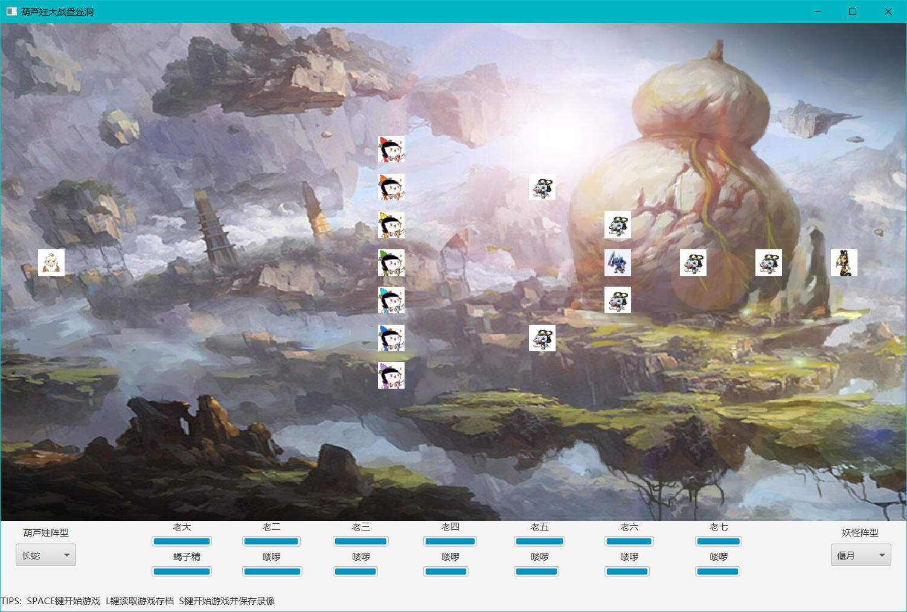

# 葫芦娃——大战盘丝洞
## 161220123 王荆涛

### 一、代码框架

<table border=0 cellpadding=0 cellspacing=0 width=639 style='border-collapse:
 collapse;table-layout:fixed;width:479pt'>
 <col width=111 style='mso-width-source:userset;mso-width-alt:3953;width:83pt'>
 <col width=149 style='mso-width-source:userset;mso-width-alt:5290;width:112pt'>
 <col width=379 style='mso-width-source:userset;mso-width-alt:13482;width:284pt'>
 <tr height=18 style='height:13.8pt'>
  <td height=18 class=xl6311769 width=111 style='height:13.8pt;width:83pt'>Package</td>
  <td class=xl6311769 width=149 style='width:112pt'>Class</td>
  <td class=xl6311769 width=379 style='width:284pt'>Info</td>
 </tr>
 <tr height=18 style='height:13.8pt'>
  <td rowspan=7 height=126 class=xl6311769 style='height:96.6pt'>Creature</td>
  <td class=xl6311769>Creature</td>
  <td class=xl6311769>抽象生物类，调用了Runnable, Move, Observer, Attack四个接口</td>
 </tr>
 <tr height=18 style='height:13.8pt'>
  <td height=18 class=xl6311769 style='height:13.8pt'>Monster</td>
  <td class=xl6311769>Creature子类，向下衍生出了Snake, Scorpion, Flunky子类</td>
 </tr>
 <tr height=18 style='height:13.8pt'>
  <td height=18 class=xl6311769 style='height:13.8pt'>Calabash</td>
  <td class=xl6311769>Creature子类，战斗主体</td>
 </tr>
 <tr height=18 style='height:13.8pt'>
  <td height=18 class=xl6311769 style='height:13.8pt'>Grandpa</td>
  <td class=xl6311769>Creature子类，判断战场胜负</td>
 </tr>
 <tr height=18 style='height:13.8pt'>
  <td height=18 class=xl6311769 style='height:13.8pt'>Snake</td>
  <td class=xl6311769>Monster子类，战斗主体</td>
 </tr>
 <tr height=18 style='height:13.8pt'>
  <td height=18 class=xl6311769 style='height:13.8pt'>Scorpion</td>
  <td class=xl6311769>Monster子类，战斗主体</td>
 </tr>
 <tr height=18 style='height:13.8pt'>
  <td height=18 class=xl6311769 style='height:13.8pt'>Flunky</td>
  <td class=xl6311769>Monster子类，战斗主体</td>
 </tr>
 <tr height=18 style='height:13.8pt'>
  <td height=18 class=xl6311769 style='height:13.8pt'>Formation</td>
  <td class=xl6311769>Formation</td>
  <td class=xl6311769>定义了所有的阵型</td>
 </tr>
 <tr height=18 style='height:13.8pt'>
  <td rowspan=6 height=108 class=xl6311769 style='height:82.8pt'>GeneralTools</td>
  <td class=xl6311769>Attack</td>
  <td class=xl6311769>定义攻击动作接口</td>
 </tr>
 <tr height=18 style='height:13.8pt'>
  <td height=18 class=xl6311769 style='height:13.8pt'>Move</td>
  <td class=xl6311769>定义移动动作接口</td>
 </tr>
 <tr height=18 style='height:13.8pt'>
  <td height=18 class=xl6311769 style='height:13.8pt'>Observer</td>
  <td class=xl6311769>定义观察最近的敌人的接口</td>
 </tr>
 <tr height=18 style='height:13.8pt'>
  <td height=18 class=xl6311769 style='height:13.8pt'>Party</td>
  <td class=xl6311769>定义阵营的枚举类型</td>
 </tr>
 <tr height=18 style='height:13.8pt'>
  <td height=18 class=xl6311769 style='height:13.8pt'>State</td>
  <td class=xl6311769>定义战场状态的枚举类型</td>
 </tr>
 <tr height=18 style='height:13.8pt'>
  <td height=18 class=xl6311769 style='height:13.8pt'>SynRunLater</td>
  <td class=xl6311769>主要用来刷新位置</td>
 </tr>
 <tr height=18 style='height:13.8pt'>
  <td rowspan=3 height=54 class=xl6311769 style='height:41.4pt'>Ground</td>
  <td class=xl6311769>Battle</td>
  <td class=xl6311769>定义了战场</td>
 </tr>
 <tr height=18 style='height:13.8pt'>
  <td height=18 class=xl6311769 style='height:13.8pt'>BattleGround</td>
  <td class=xl6311769>定义了显示的战场背景</td>
 </tr>
 <tr height=18 style='height:13.8pt'>
  <td height=18 class=xl6311769 style='height:13.8pt'>Point</td>
  <td class=xl6311769>战场是由Point组成的</td>
 </tr>
 <tr height=18 style='height:13.8pt'>
  <td rowspan=2 height=36 class=xl6311769 style='height:27.6pt'>RecordSystem</td>
  <td class=xl6311769>Recorder</td>
  <td class=xl6311769>定义了记录仪类</td>
 </tr>
 <tr height=18 style='height:13.8pt'>
  <td height=18 class=xl6311769 style='height:13.8pt'>Replay</td>
  <td class=xl6311769>定义了回放系统类</td>
 </tr>
 <tr height=18 style='height:13.8pt'>
  <td height=18 class=xl6311769 style='height:13.8pt'>MainDemo</td>
  <td class=xl6311769>MainDemo</td>
  <td class=xl6311769>驱动类</td>
 </tr>
 <![if supportMisalignedColumns]>
 <tr height=0 style='display:none'>
  <td width=111 style='width:83pt'></td>
  <td width=149 style='width:112pt'></td>
  <td width=379 style='width:284pt'></td>
 </tr>
 <![endif]>
</table>

### 二、运行方法
#### 1、开始战斗
开始战斗前要先通过左右两端的阵型选择按钮选择阵型，然后按空格键开始战斗
#### 2、保存录像
同开始战斗一样，开始时要先选择阵型，然后按下S键开始战斗，录像会保存在GameRecords文件夹中
#### 3、回放录像
按下L键会弹出文件夹选择窗口，选择相应的以时间为文件夹名保存的文件夹即可回放，回放结束后自动返回初始界面

### 三、思路描述
#### 1、战场实现
战场实现实际上继承了第三次作业中的思路，将战场上每个点作为一个类型Point，在这个Point中可以设置生物体，也可以清空等，通过一个个Point构成了二维战场BattleGround。BattleGround作为二维战场，提供的功能含简单，就是包含了战场上所有位置的生物，然后在生物移动的时候用于判断该生物能不能走到他想去的位置。在此基础上抽象出了Battle，这个是战斗抽象，包含了战斗两方阵营的实体，包含了战斗录像系统,最重要的是包含了线程池，用于多线程程序运行。通过中断机制不断判断当前战斗状态，并按照一定的频率刷新，便呈现出了战斗过程。

#### 2、生物抽象
生物体抽象我利用到了Observe，Move，Attack三个接口，分别表现出了生物在战斗中的动作顺序，即：我作为战场上的一员，我先要通过观察寻找离我最近的对手，找到之后我要向着他的方向移动，当到达一定距离后，我才能发动攻击。若战场上没有对手，则存活的一方胜利。那么战场上这么多的生物，怎么能做到每个人同时干自己的这些工作呢？所以调用了Runnable接口，重载里面的run方法，利用cpu线程调度，微观上串行，宏观上并行完成每个人的工作即可。

#### 3、录像回放系统
因为我个人的实现问题，在屏幕显示坐标和生物在BattleGround里面的坐标有时候会出现不同步的问题，在转换过程中按照比例缩放转换后有精度损失，如果通过普通的写txt文件保存每一步的坐标记录不太现实，所以我想到了用截取屏幕的方式完成录像系统。通过java.awt.*中的Robot对屏幕进行截屏，每隔0.1s记录一次（与我生物移动后刷新战场的频率一致），保存到用系统时间为名字的文件夹中，再利用javaFX中的DirectoryChooser选择记录，读取图片并按照相同的频率按顺序显示即可。

### 四、重点代码详解
#### javaFX框架场景
```java
public class Main extends Application {
    public static Pane root;
    public static Stage stage;
    public static Scene scene;
    //葫芦娃阵型选择工具
    private static ChoiceBox calabashFormat;
    //妖怪阵型选择工具
    private static ChoiceBox monsterFormat;
    //文字性 说明
    private static Label tips;
    private static Label label1;
    private static Label label2;
    private Battle battle;
    //回放录像工具
    private Replay replay;
    private State state;
    ……
    @Override
    public void start(Stage primaryStage) throws Exception{
        root = new Pane();
        stage = primaryStage;
        stage.setTitle("葫芦娃大战盘丝洞");
        scene = new Scene(root, 1200,780);

        //场景中所有需要显示的图片都如下方法创建
        //图片显示类
        Image image = ……;
        //图片显示类
        ImageView imageView = new ImageView(); 
        imageView.setImage(image);
        //设置放在root上的X坐标
        imageView.setLayoutX(0);  
        //设置放在root上的Y坐标
        imageView.setLayoutY(0);
        //加入root.getChildren就可以显示了
        root.getChildren().add(imageView);  

        ……

        primaryStage.setMinHeight(780);
        primaryStage.setMinWidth(1200);
        primaryStage.setScene(scene);
        primaryStage.show();

        /**
        * 设置了监听类，用来检测鼠标，键盘的动作，并作出响应
        * 省略其余代码
        */
        calabashFormat.setOnAction(new EventHandler<ActionEvent>() {
            @Override
            public void handle(ActionEvent event) {
                int index1 = calabashFormat.getSelectionModel().getSelectedIndex();
                battle.setCalabashFormat(index1);
            }
        });

        ……
    }

    public static void main(String[] args) {
        launch(args);
    }
}
```
在MainDemo中，我构建了显示的窗口主体，插入了两个阵型选择按钮，设置好背景就可以显示了，其中用到了lambda表达式等

#### Battle
```java
public class Battle {
    private BattleGround battleGround;
    private ArrayList<Calabash> calabashes;
    private ArrayList<Monster> monsters;
    ……
    private Thread replayThread;
    private Recorder recorder;
    
    //包含的方法省略
}
```
Battle类中主要定义了战斗状态所需要用到的一些方法，包含了一个二维Point数组构成的BattleGround，战斗中的生物体的ArrayList，战斗初始化，战斗重置，战斗停止等方法，最重要的是包含了生物体的线程池，以便完成多线程操作

#### Creature
```java
public abstract class Creature implements Runnable, Move, Observer, Attack{
    //在屏幕上显示的坐标
    protected int xp, yp;
    //即将移动过去的坐标
    protected int nx, ny;
    //在BattleGround这个二维战场上的坐标
    protected int x, y;
    //用于记录攻击回合
    protected int turnAll;
    protected int turnNow;
    //该生物体的显示
    protected ImageView imageView;
    //生物体的线程编号，便于从线程池中挑出来对其进行一些操作
    protected int threadID;
    protected double nowBlood;
    protected double initblood;
    protected String creatureName;
    //生物的阵营选择
    protected Party party;
    protected boolean isAlive;
    protected boolean isFight;
    //血量条的显示
    protected ProgressBar progressBar;
    protected Battle battle;

    @Override
    public void run() {
        //找敌人
        //移动
        //攻击
        //刷新界面
    }
}
```
##### 无论是葫芦娃还是蛇精、蝎子精、喽啰们，他们所能做出的动作都差不多：
线程开始后，先调用nearEnemy函数来寻找离自己最近的对手，nearEnemy函数会返回找到的敌人，然后计算该生物与敌人之间的距离，小于一定范围即可开始攻击，否则生物朝着敌人的方向移动。移动这个动作被我分成了两个部分，一部分来自于Move接口中的方法，另一部分是creature的新的方法moveOn，这是为了将每一个动作更加抽象，move仅用来改变生物的坐标，而moveOn则表现了生物一直运动的一个趋势（实际上初期我还定义了Direction枚举类型，moveOn最初被我设计的是一个朝某一方向移动的函数，但是因为后期我自己线程实现的不好，无奈舍弃）
```java
@Override
public void attack(Creature enemy){
        synchronized (battle){
            if(this.isAlive() && enemy.isAlive()){
                int test = new Random().nextInt(2);
                if(test == 0) {
                    if(enemy.nowBlood / enemy.initblood < 0.5)
                        enemy.killed();
                    else{
                        enemy.progressBar.setProgress(enemy.nowBlood / enemy.initblood);
                    }
                    this.nowBlood = this.nowBlood - 30;
                    progressBar.setProgress(this.nowBlood / this.initblood);
                    turnNow++;
                    if(turnNow == turnAll)
                        this.killed();
                }
                else{
                    if(this.nowBlood / this.initblood < 0.5)
                        this.killed();
                    else{
                        this.progressBar.setProgress(this.nowBlood / this.initblood);
                    }
                    enemy.nowBlood = enemy.nowBlood - 30;
                    enemy.progressBar.setProgress(enemy.nowBlood / enemy.initblood);
                    enemy.turnNow++;
                    if(enemy.turnNow == enemy.turnAll)
                        enemy.killed();
                }
            }
        }
    }
```
攻击动作以葫芦娃的为例，当战斗双方都存货的时候，以同等概率随机让某一方先出手（模仿回合制游戏），如果某一方血量低于50%，将遭受致命一击，直接死亡，同时存活的一方减少30点血量，同时存活方的turnNow增加一次，到达规定的出手次数的时候，也会精疲力尽而死
#### Recorder
```java
public class Recorder implements Runnable{
    private Node view;
    private Robot robot;
    ……
    public Recorder(Node node) {
        ……
        //创建目录
        new File(currentDir).mkdirs();
    }

    @Override
    public void run(){
        while(!Thread.interrupted()){
            try{
                //捕获屏幕指定的区域
                BufferedImage image = robot.createScreenCapture(new Rectangle((int)Main.stage.getX() + 1, (int)Main.stage.getY(),
                        1200,780));
                ImageIO.write(image,  "png", new File(currentDir + "/" + i + ".png"));
                //每1s截一次屏幕
                TimeUnit.MILLISECONDS.sleep(100);
            }catch(InterruptedException e1){
            }catch(IOException e3){
                e3.printStackTrace();
            }
        }
    }
}
```
整个Recorder实现比较简单，利用了Robot能够轻松获取stage在电脑屏幕上的坐标，然后加入线程中，按规定0.1s截图即可（截图频率快于战场刷新频率，这样保证了回放信息不缺少）。Replay实现也很简单，相当于图片的读取操作

### 五、实现效果

初始战场，通过选择阵型后双方会显示在战场上

### 六、心得体会
#### 1、SOLID 原则
SOLID原则一定要牢记在心，实际上在写大作业的过程中，我尽力去抽象很多动作，但是实践起来会发现非常难，就像是余老师讲的，不好的抽象和不抽象都是没有用的。有时候将功能分的太细，反而对设计产生了反作用
#### 2、里氏替换原则
代码中多次运用了里氏替换原则，就例如在重写nearEnemy中，本来在接口中定义的是Creature返回值，但我在针对葫芦娃和妖怪不同个体去寻找的时候，直接用他们敌对的生物体（妖怪/葫芦娃）作为返回值，说明了所有的对象都能用基类替换
#### 3、单元测试
利用JUnit进行了简单的单元测试，尝试使用局部函数测试的方法来检测程序的对错，为以后开发大型软件提供了一个很好的帮助工具和经验
#### 4、多线程
战场初始化的时候将所有的生物放入线程池，当响应空格键的动作时，开始战斗，同时将Threads中的所有Thread调用start，开始他们的线程。因为继承了Runnable接口，在run函数内部循环调用：寻找敌人，移动，攻击这个动作组，当生物死亡的时候，发出interrupt，利用Thread.interrupted()来停止run函数内部循环，结束了他的战斗。同时，因为在生物体移动和攻击的过程中，需要刷新血量条和坐标等，这时候会访问Battle。所以在调用battle这个公共资源的时候，加上synchronized，对他进行上锁，使之变成临界区资源，其他所有线程访问这个资源的时候，都要先判断该资源是否正在被访问，并进入队列等待访问该资源。
#### 5、Git使用
之前已经提交过几次作业了，但是因为改动比较简单也没有出现过冲突的问题。但是这次提交却让我精疲力竭，因为手误在本地删除了前几次仓库中的所有文件，却不知道怎么恢复，最终还是在曹老师的训诫中清醒过来。今天花了很久去看了git全部的使用文档和相关教程，自己也对很多操作有了重新的理解。通过很多次的实践，不断回退版本，查看log、reflog、status等操作，终于将冲突问题修改好重新提交。拖延症真的不能有，而且遇到困难要沉着冷静，这也算是给我上了一个意外的、却无比珍贵的教训。
#### 6、最后是一点自己想说的话
通过实现大作业，才发现自己的动手能力有多差，老师们非常用心的教了，可我自己的实现能力实在是不行，很多方法，比如单例模式和工厂模式，我自己看书看起来是懂了，但是一考试发现自己也仅仅是看了书，并没有深刻理解和应用。对于我个人来说，这个大作业其实让我看到了自己身上的许多问题。Java很有趣，老师教的很棒，助教也很负责，课程虽然结束了，但是我仍在Java上还有很长的路要走。
